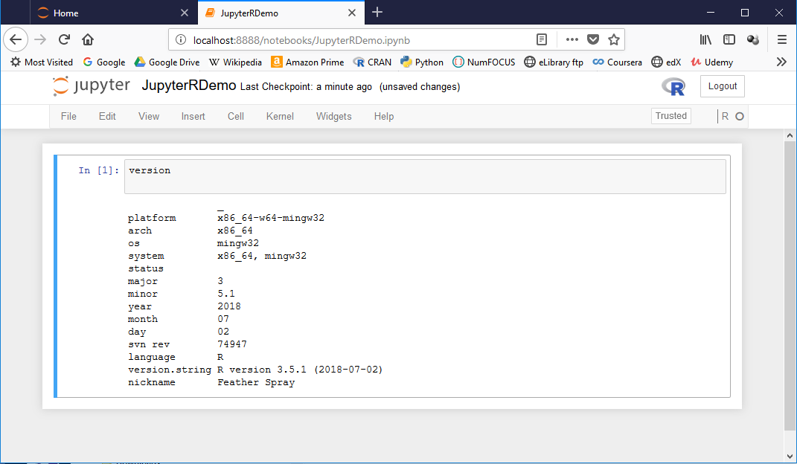
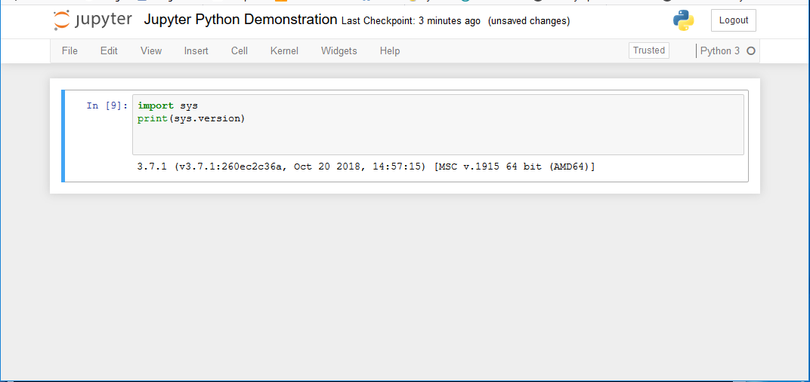

# Set-up for R and Python Exercises
  
Clearly you have to get R and python onto your system. I have a bias about dependance on any en block installed software stacks, like Anaconda etc. Anaconda is a convenient way to install programs together. However it is easy to loose locations of programs and tools and have conflicts with installs from outside of the group installers, such as different Python destributions, and difficult to manage path complexity. 

Just the same, Anaconda is a good choice if you are doing a clean install and intend to do everthing inside that framework.Then installing [Anaconda,Python Data Science Platform](https://www.anaconda.com/) can make things much easier in the long run for integrating R and Python and Reproducible Research work. 

All of these sites will help you approach installs and configurations in a variety of ways. As an R programmer, first I installed [R](https://www.r-project.org/), then [RStudio^4^](https://www.rstudio.com/). Once installed, RStudio is a convenient way to install the R packages as well. 

Then I installed Python 3 from [Python Software Foundation](https://www.python.org/). From that point on I used PIP package manager for python and RGUI for package installs for python and R respectively and install jupyter see [Project Jupyter](http://jupyter.org/install).\index{Project Jupyter} This gave the maximum flexibility for R and Python in their own environments. I also installed the Scipy \index{SciPy} (which includes numpy \index{numpy}, and Matplotlib \index{Matplotlib} all using PIP.

I did do a parallel Anaconda \index{Anaconda} install afterwards with R and RStudio \index{RStudio} and iPython \index{iPython} for Jupyter Notebooks but as mentioned there was some path confusion with this approach. It does set you up nicely for any approach to data science and development you could choose down the road.

You really are going to need an IDE for Python. [Spyder](https://www.spyder-ide.org/) \index{Spyder}, available separately installed with PIP, or installed through Anaconda. It is a solid python focused choice. I personally use [Eclipse](https://www.eclipse.org/) \index{Eclipse}as it is open sourced and you can use it for multiple languages including R (not as strong yet) and python, HTML/CSS/javascript, C/C++, Java and others. 


## Package Libraries

The strength of both R and Python is from their libraries. [CRAN Package  Repository](https://cran.cnr.berkeley.edu/index.html) \index{CRAN}and [Bioconductor](http://www.bioconductor.org/about/) \index{Bioconductor} are both well stocked with general and special purposed functions for R. RStudio develops [R Packages](https://www.rstudio.com/products/rpackages/) integrating well with the RStudio environment. The are lost of R packages in development awaiting addition to CRAN or hosted outside of CRAN such as on [Github](https://github.com/search?q=R+language) \index{R on Github}.

If the reader has spent any time with R at all you have likely made inroads into these package sources. So how does Python compare? Python comes with a large standard library providing "out of the gate" functionality to compare with R-core. The best handing of the intricacies of the python standard library I've found is Doug Helmann's [The Python 3 Standard Library by example](https://amazon.com/Python-Standard-Library-Example-Developers/dp/0134291050/). Python Software foundation hosts the [Python Package Index , PyPi](https://pypi.org/) \index{PyPi} analygous to the CRAN repositories and \index{Bioconnector}. Also, the most important resource to get you up to speed is [SciPy tools](https://www.scipy.org/) consisting of SciPy, Numpy, Pandas and Matplotlib. These are the essential minimum to do any R-like work in python. These and more can be accessed as well through the [Numfocus Projects](https://numfocus.org/sponsored-projects). \index{Numfocus} Finally, you should check out the [StatsModels^11^](https://www.statsmodels.org/stable/index.html)  \index{StatsModels} package site.

## Pulling it Together

Having apprised ourselves of the breadth and availability of these resources we will go forward and organize some of the ideas. R packages can be installed with the R GUI but the RStudio environment is much easier for this. Once a package is installed it is available in all environments I've alluded to. Compiling and installing is always best and I thing RStudio makes this fairly painless. Remember to start the GUI, Anaconda or RStudio environment as administrator to keep things together.
  
  
### The Prompts
  
When accessing the R and Python interpreters from the command shell (or bash) prompt,
```
$
```
  
after the version and copyright banners, if present, you are at an interpreter prompt.
For R this is:
```
>
```

for python,
```
>>>
```

for iPython
```
In [1]:
```

from this point you enter what ever commands or statements you wish  to execute. These are executed immediately, or continued with continuation prompts until executable. Once executed any declarations and output are retained if the were assigned to some object to be held in memory. Immediate answers are generally lost.

Otherwise, one groups statements into a file to be read all at once and executed as a group. Objects created are again retained in memory by default. This is a script of program. Script file extensions are standardized for the operating system to recognize, eg.(.R for R, and .py or pyc for python). Python scripts intended to be called by other scripts for library code to be incorporated are called modules and end in the same .py extension. A package can be considered, in both R and python) as a collection of declarations, functions, classes, or modules for library purposes.


### Installing Packages \index{Installing R Packages}

From the R GUI prompt we have \index{package-install()},

```
  package-install()
```

Python packages from any source mentioned above can be installed with the PIP utility. This can be done from the shell prompt (remember to start as administrator or root) \index{installing with PIP}:

```

  $ pip install matplotlib  
    # OR
  $ python -m pip install matplotlib

```

This can be done as root with the anaconda prompt as well.

### Using Packages

In R we must make sure the package (once installed) is loaded for our session. This is done with the library() function,

```{r}
  library("reticulate")
```

while in python we import the package previously installed as,

```
  import numpy
```

Once imported or loaded into either, we can access the functions of reticulate directly by name. If we have a previous function of the same name it gets overwritten unless in python we keep the name spaces separate. This can be done by the form of the import statement. We can also import only slected functions from a package module.


```

  import numpy as np             # usual format to use \index{namespace} segregation of functions
  from numpy import sum, matrix  # economical import,still can conflict without renaming 
                                 #   using 'as', such as where base python has a sum()  
                                 #   function and math has a different one called sum()
```

## Using R and Python Together

There are several ways that one could find helpful to use R and Python together, to take best advantage of their respective strengths 

### Working in R and Calling Python

  In this instance one would find working in R the necessary starting place loading the reticulate  \index{reticulate} library when finding the need to employ python functions or packages as helpful to your needs. A call would be made to the python function from R to have a task completed by python and control returned to the R program. 

```{r}
cat("PI in R is", pi)
```

```{python}
import math
print(math.pi)
```

  

### Working in Python and Calling R

Working in python and calling an R object requires the rpy2 \index{rpy2} package and would look like,

```
# Accessing an R object from from python 
# (example from: http://rpy.sourceforge.net/rpy2/doc-dev/html/introduction.html)
import rpy2.robjects as robjects
rpi = robjects.r['pi']
print("PI from R = ", rpi)

```

### Working in Jupyter and Writing in R, Python or Both in the Same Notebook

There are multiple kernel plugins available for jupyter notebooks. As A rule, the notebooks only use one language kernel at a time. An exception is the [SOS kernel](https://vatlab.github.io/sos-docs/.

Jupyter is running first level in python. It is afterall a python module. When running the R kernel (irkernel)\index{irkernel} remember you are running R in python. See the caution below in the contest of rMarkdown code chunks.

Consider this Jupyter notebook using the R kernel,




and this Jupyter notebook using the 'Python kernel',



  
### Working in rmarkdown and Using R and Python Code Chunks

Now consider an index{rmarkdown} session running primarily in R. The T code chunks are executed in the same R session as the rMarkdown. On the otherhand, a python code chunk is running in a python guest environment in the R level host using reticulate \index{reticulate}.

Caution: I have found behavior is unpredictible to call R objects back with Python chunks run in rmarkdown (ie. inside another instance of R). The identity of R_User for rpy2 gets lost. There are limits to how deeply you should nest languages within languages.

That said, the rmarkdown chunks look like this.

```
'''{r}
cat("PI in R is", pi)
'''
```

```
'''{python}
import math
print(math.pi)
'''
```
  