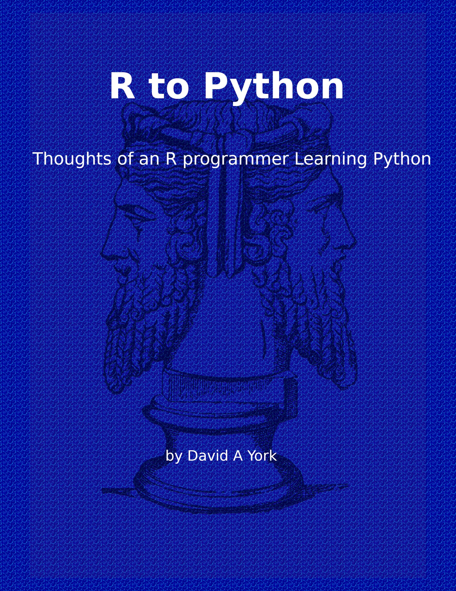

# RPythonBook

A Small book discussing transitioning for R scripting to R and Python programming for Data Science. Presented in a comparative discussion with a goal of supporting adoption of mixed R and Python programming in the Data Science setting. 

[Start Book](docs/fronmatter.html)
